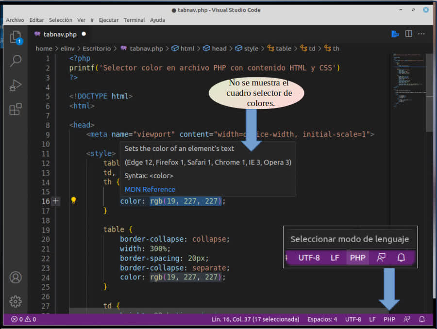
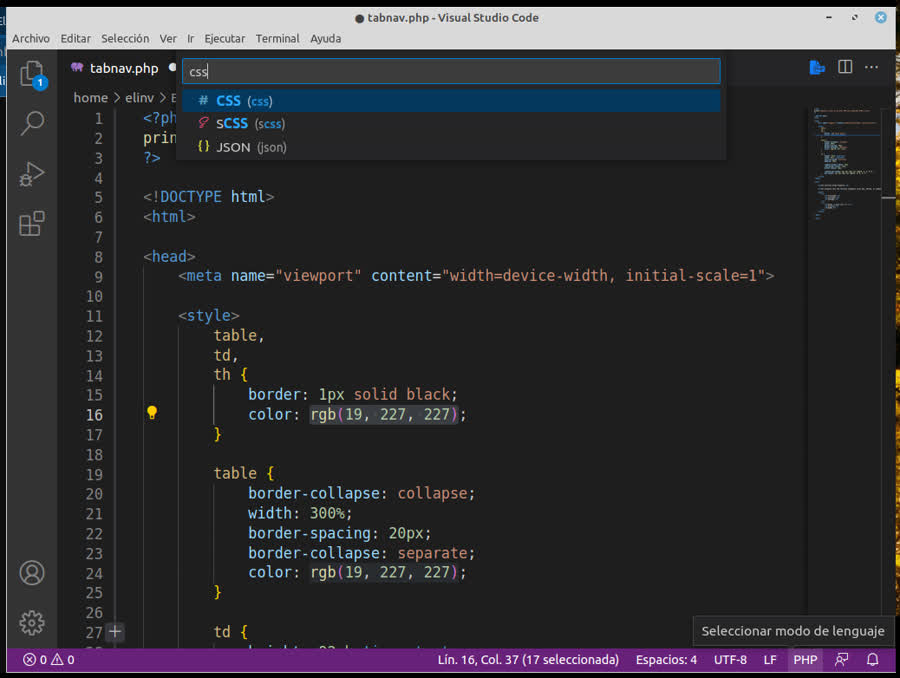
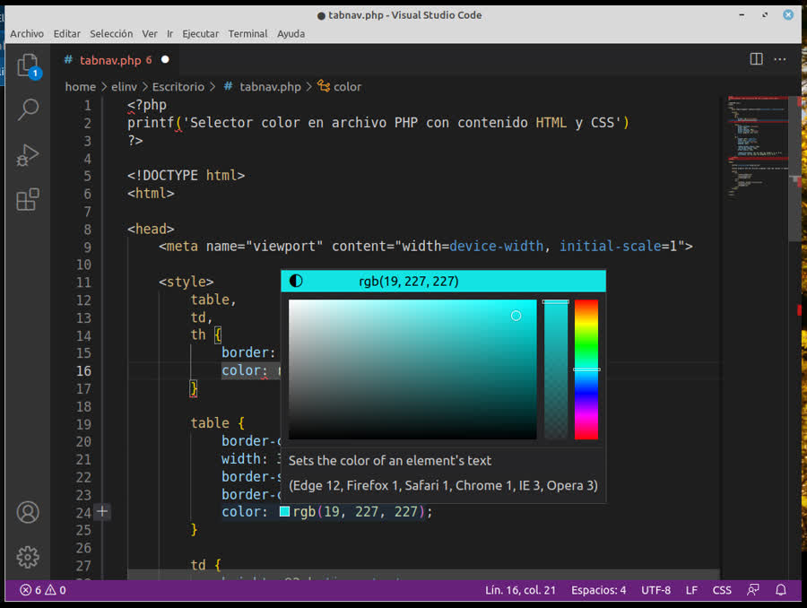
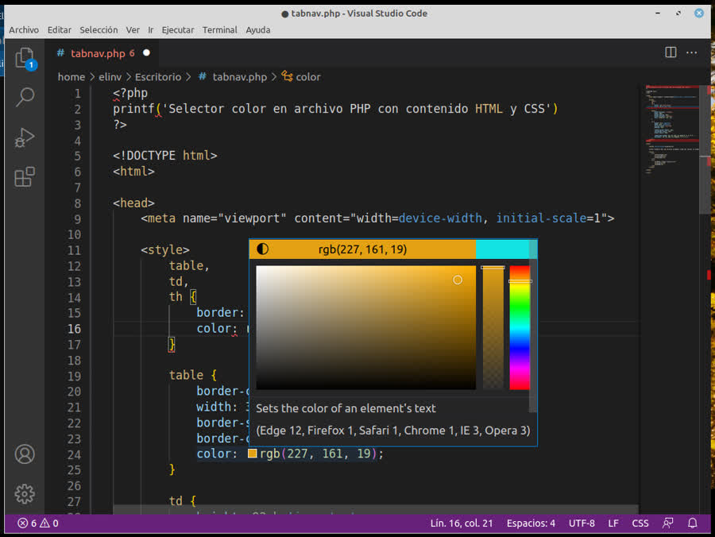
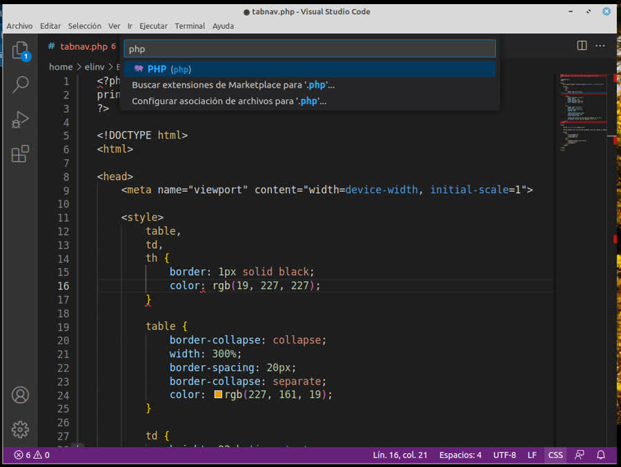
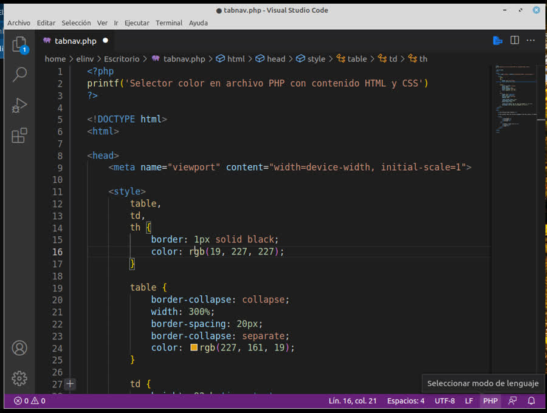
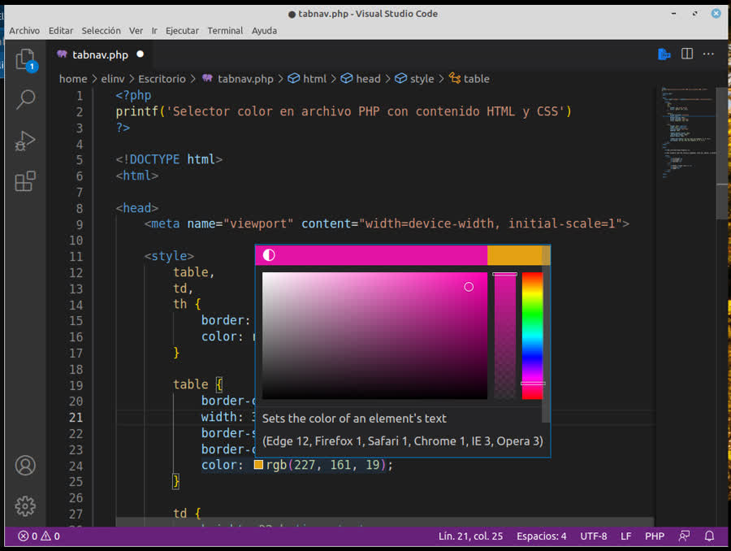

  

<h3 align="center">En archivo con extensión php, 
  habilitar selector de color en CSS estilo,  
  sin ninguna extensión.</h3>

---

 Como lograrlo?
      

## 📝 Pasos para lograrlo en cualquier archivo PHP   
      con contenido HTML y CSS 
      [
        <style>
          color: rgb(19, 227, 227);
        <style>
      ]

---

- [Al cargar cualquier archivo](#Paso1)
## No se muestra el selector de colores y se observa que el lenguaje seleccionado es PHP

  

---

- [Seleccionar modo de lenguaje](#Paso2)

## cambiar a CSS

  

---

- [Selector de colores visible](#Paso3)

## Con el lenguaje seleccionado en CSS,  el selector de colores se vuelve visible.

  

---

- [Prueba del selector de colores visible](#Paso4)

## Con el lenguaje seleccionado en CSS,  el selector de colores se vuelve visible.[No es necesario]

  

---

- [Comprobamos su efectividad!](#Paso5)

  

---

- [Cambiamos nuevamente el modo de lenguaje a PHP!](#Paso6)

## Para seguir trabajando con nuestro Php con contenido HTML y CSS, cambiamos nuevamente el modo de lenguaje a PHP.

  

---

- [Ya con el modo de lenguaje a PHP! el selector de colores sigue funcionando!](#Paso7)

  

---

## 🧐 Mas info 

- No he intentado siquiera como volver permanente esto.
- Con lo cual al cerrar el archivo PHP y volver a abrirlo, 
es necesario volver a cambiar el lenguaje a CSS y a PHP.
- Extensiones instaladas:
### PHP Intelephense      v1.9.1
### HTML CSS Support      v1.13.1
### All Autocomplete      v0.0.23

---

### Bueno de esta forma puedo trabajar en Visual Studio Code en Linux Mint, en archivos PHP, que contienen código HTML y CSS.

Utilizando los elementos ya incorporados a VSC.

---

- Web de Elinv:

<a href="https://www.elinv.musica.ar/paciencia/">
   Enlace a la web de Elinv
</a>

- Ver info de Elinv en Google Search:

<a href="https://www.google.com.ar/search?q=elinv">
   Enlace a la info de Elinv  -> en Google Search
</a>

👍 Gracias!

---

🛠️ Errores, sugerencias, ideas, envialas a nuestro mail: <elinv.elinv@gmail.com>

---

# E L I N V

